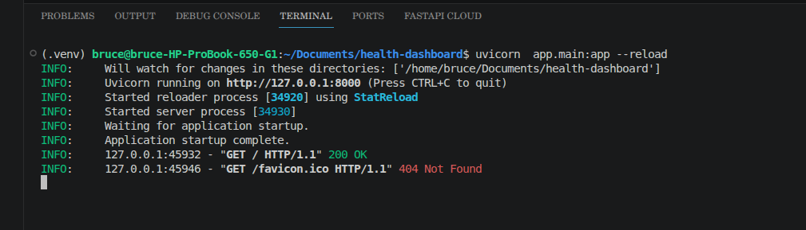
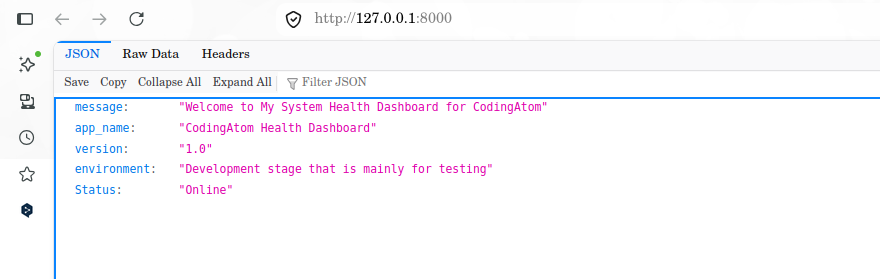
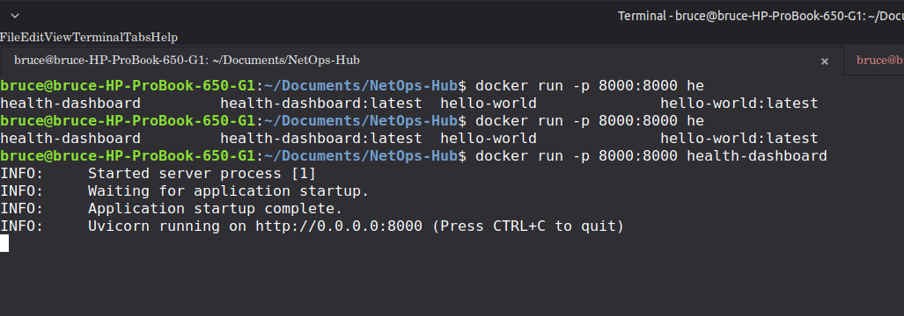
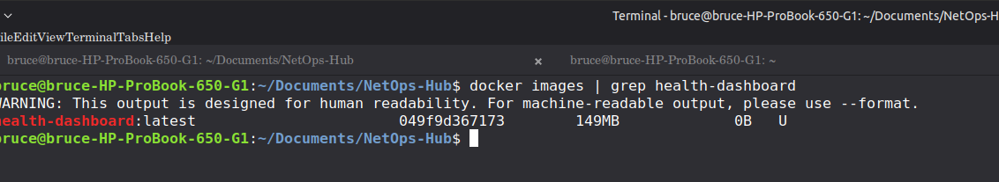
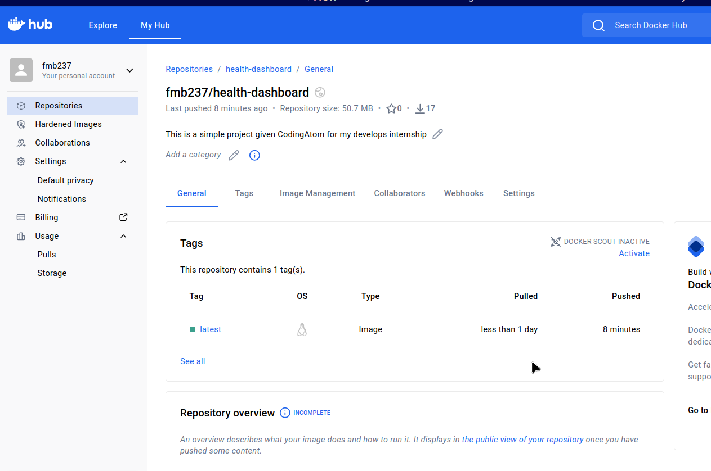

# 🚀 System Health Dashboard

[](https://github.com/fmb237/health-dashboard/actions)
[](https://hub.docker.com/)

A production-ready, full-stack health monitoring application developed by **Fouenang Miguel Bruce** as part of the **CodingAtom Internship**. This project demonstrates a complete DevSecOps lifecycle: from local development and automated testing to containerization and cloud deployment.

## 🎯 Project Objective
The goal was to build a robust health-dashboard that provides both a professional visual interface for users and a technical API for monitoring tools, while implementing industry-standard DevOps practices to ensure a secure and optimized deployment.

## 🛠️ Tech Stack
- **Backend**: FastAPI (Python 3.12)
- **Frontend**: Jinja2 Templates, Tailwind CSS, JavaScript (Fetch API)
- **Configuration**: Pydantic Settings
- **Testing**: Pytest, HTTPX
- **Containerization**: Docker (Multi-stage build)
- **CI/CD**: GitHub Actions
- **Deployment**: Render (Docker Runtime)

## 🏗️ DevOps Architecture

### 1. Full-Stack Integration
The application features a dual-layer interface:
- **Visual Dashboard**: A modern, dark-mode frontend built with Tailwind CSS that polls the health API in real-time to display system status.
- **REST API**: Technical endpoints (`/health`, `/info`) providing machine-readable JSON data for automated monitoring.

### 2. Multi-Stage Docker Build
To ensure the smallest possible attack surface and image size, I implemented a **multi-stage Dockerfile**. 
- **Builder Stage**: Installs dependencies and prepares the environment.
- **Final Stage**: Uses `python:3.12-slim`, copies only the necessary artifacts, and runs as a non-root user for enhanced security.

### 3. CI/CD Pipeline
The project features a fully automated pipeline via GitHub Actions:
- **Continuous Integration (CI)**: On every push, the pipeline triggers `pytest` to ensure no regressions are introduced.
- **Continuous Delivery (CD)**: Upon successful tests, the pipeline builds the Docker image and pushes it to **Docker Hub**.
- **Continuous Deployment**: The image is automatically deployed to **Render**, ensuring the production environment is always up-to-date.

## 📸 Evidence & Screenshots

### 🖥️ Application in Action
| Server Starting | Browser View (Frontend) | Running via Docker |
| :---: | :---: | :---: |
|  |  |  |

### 📦 Optimization & Registry
| Docker Image Size | Docker Hub Repository |
| :---: | :---: |
|  |  |

## 🚀 Getting Started

### Local Development
1. **Clone the repo**:
   ```bash
   git clone https://github.com/fmb237/health-dashboard.git
   cd health-dashboard
   ```
2. **Setup Environment**:
   ```bash
   python3 -m venv .venv
   source .venv/bin/activate
   pip install -r requirements.txt
   ```
3. **Run the App**:
   ```bash
   uvicorn app.main:app --reload
   ```

### Running with Docker
```bash
# Build the image
docker build -t health-dashboard .

# Run the container
docker run -p 8000:8000 health-dashboard
```

## 🎓 Acknowledgments
Special thanks to **CodingAtom** for providing the internship opportunity to apply DevOps and Full-Stack skills in a real-world scenario.
